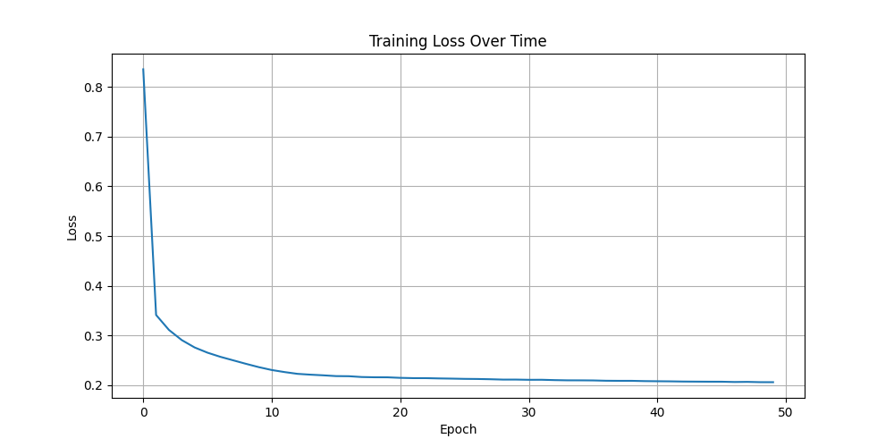

# Raport: Predykcja Spalanych Kalorii

# 1. Cel Projektu
# Stworzenie modelu sieci neuronowej do predykcji liczby spalanych kalorii podczas treningu na podstawie danych użytkownika.

# 2. Dataset
# Źródło: Kaggle Playground Series S5E5
# Liczba próbek: 750,000
# Cechy wejściowe: Age, Height, Weight, Duration, Heart_Rate, Body_Temp, Sex
# Zmienna docelowa: Calories (liczba spalanych kalorii)

# 3. Architektura Modelu
# Warstwa 1: Dense(7 → 32) + ReLU + Dropout(0.3)
# Warstwa 2: Dense(32 → 16) + ReLU + Dropout(0.2)
# Warstwa 3: Dense(16 → 1)

# 4. Parametry Treningowe
# Epoki: 50
# Batch size: 32
# Learning rate: 0.0005
# Momentum: 0.85
# Optimizer: SGD
# Loss function: RMSLE

# 5. Wyniki
# RMSLE Score (publicznie): 0.08661
# RMSLE Score (prywatnie): 0.08728
# Krzywa treningu 

# 6. Analiza Danych
# Brak błędów/braku wartości (NaN)
# Normalizacja min-max dla wszystkich cech
# Kolumna `Sex` zakodowana: male=1, female=0

# 7. Kod
# Trening: `src/train.py`
# Predykcja: `src/predict.py`
# Model: `src/model.py`
# Dataset: `src/workout_dataset.py`